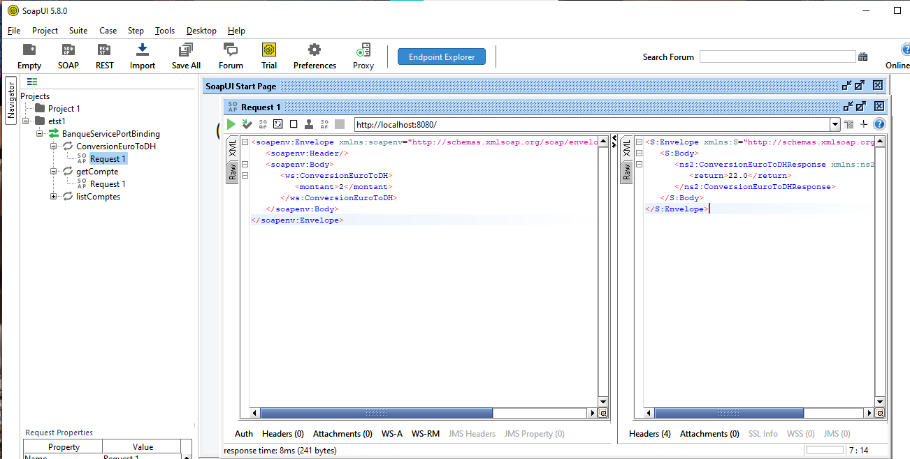

#  Projet Java - Web Service SOAP avec GAX-WS (Banque Service)

Ce projet est un exemple simple d’implémentation d’un **Web Service SOAP** en Java, utilisant **Jakarta JAX-WS** (anciennement JAX-WS RI) pour exposer un service bancaire nommé `BanqueWS`. Le projet inclut un **serveur SOAP**, un **client SOAP (Test Consumer)**, et des exemples de requêtes et réponses SOAP avec **SoapUI**.


## Objectif

Ce service expose 3 opérations SOAP :
- `conversionEuroToDH(montant)` : Convertit un montant en euro vers le dirham (taux fixe de 11).
- `getCompte(code)` : Retourne les informations d’un compte bancaire.
- `listComptes()` : Retourne une liste de comptes générés dynamiquement.


##  Technologies utilisées

- Java 17+
- Jakarta JAX-WS (GAX-WS)
- SOAP / WSDL
- SoapUI (pour les tests manuels)
- JDK HTTP Server intégré
- Aucune dépendance externe (pas de Maven)


##  Explication des classes

###  `BanqueService.java` (dans `ws`)

Classe principale annotée avec `@WebService`. Elle expose 3 méthodes comme opérations SOAP :

```java
@WebMethod(operationName = "ConversionEuroToDH")
public double conversion(@WebParam(name = "montant") double mt) {
    return mt * 11;
}
````

* `conversion(...)` : Convertit un montant euro en dirham.
* `getCompte(...)` : Retourne un compte avec un solde aléatoire.
* `listComptes()` : Retourne une liste de 3 comptes factices.

### `Compte.java`

Classe modèle qui représente un compte bancaire :

```java
public class Compte {
    private int code;
    private double solde;
    private Date dateCreation;
    // Getters, setters, constructeurs
}
```

---

###  `ServerJWS.java`

Point d’entrée pour **démarrer le serveur**. Il publie le service à l’URL suivante :
`http://0.0.0.0:8080/`

```java
Endpoint.publish("http://0.0.0.0:8080/", new BanqueService());
```

> Une fois démarré, le WSDL est disponible à :
> `http://localhost:8080/BanqueWS?wsdl`

---

## Aperçu du Service SOAP dans SoapUI

Voici une requête de test faite avec SoapUI :



### `Main.java` (Client SOAP)

C’est un client Java qui **consomme** le web service via le proxy généré (package `proxy`) :

```java
BanqueService proxy = new BanqueWS().getBanqueServicePort();
System.out.println(proxy.conversionEuroToDH(90));
```

Il affiche les données d’un compte et itère sur la liste des comptes retournés.

> Les classes du package `proxy` sont générées automatiquement via `wsimport`.

---

## Déploiement du Web Service

1. Compile le projet :

```bash
javac -d out src/ws/*.java
```

2. Démarre le serveur :

```bash
java -cp out ws.ServerJWS
```

3. Vérifie dans le navigateur :
   Accède à `http://localhost:8080/BanqueWS?wsdl`

---

## Tester avec SoapUI

### Requête (conversionEuroToDH) :

```xml
<soapenv:Envelope xmlns:soapenv="http://schemas.xmlsoap.org/soap/envelope/" xmlns:ws="http://ws/">
   <soapenv:Header/>
   <soapenv:Body>
      <ws:ConversionEuroToDH>
         <montant>2</montant>
      </ws:ConversionEuroToDH>
   </soapenv:Body>
</soapenv:Envelope>
```

### Réponse attendue :

```xml
<S:Envelope xmlns:S="http://schemas.xmlsoap.org/soap/envelope/">
   <S:Body>
      <ns2:ConversionEuroToDHResponse xmlns:ns2="http://ws/">
         <return>22.0</return>
      </ns2:ConversionEuroToDHResponse>
   </S:Body>
</S:Envelope>
```

---

## Génération du client SOAP avec `wsimport`

Si tu veux générer manuellement les classes proxy :

```bash
wsimport -keep -p proxy http://localhost:8080/BanqueWS?wsdl
```

Cela génère les classes Java dans le package `proxy`.

---

## Résultat (console)

```bash
990.0
--------------------------
4
42259.48
Sat Jun 01 12:04:05 WET 2025
---------------
1
53342.16
Sat Jun 01 12:04:05 WET 2025
```

## Auteur

Projet développé par **Fatima**
Étudiante en Data Science

````
